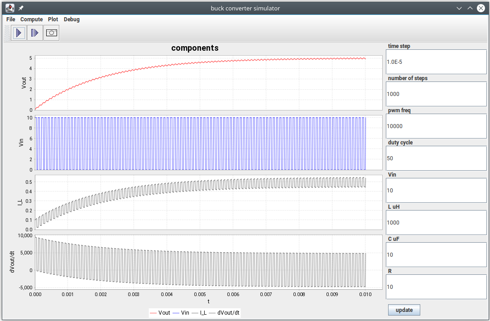

# [Buck converter](https://en.wikipedia.org/wiki/Buck_converter) simulator
---

This is a Buck converter simulator for java.
The simulation is generated by directly integrating the simplified Buck Converter
ODE (ordinary differential equation).




## Build

In linux/osx/un*x:
```
mvnw clean package
```
in windows:
```
mvnw.cmd clean package
```
The built jar file is in the target folder. 
Note there are dependencies to libraries in the libs folder. 
If you want to run it independently, in the target folder,
preserve the generated jar file and its libs subdirectory jar files and structure.
This set is needed to run without errors. e.g.
```
jbuckconv-0.1.0.jar
libs/commons-math3-3.6.1.jar
libs/jfreechart-1.5.3.jar
libs/log4j-api-2.17.2.jar
libs/log4j-core-2.17.2.jar
```

## Run

In the target folder run the generated  jbuckconv-*.jar, e.g.
```
java -jar jbuckconv-0.1.0.jar
```
You might be able to simply double click the jar file to run it. 

## Pre-requisites

This requires Java 11 to build and/or run.

## Notes / limitations

There is no assurance if the ODE or that integration (simulation) is after all correct. 
It basically runs the idealized (currently only on state) ODE through the Runge Kutta integrator,
The ODE derivations is in the doc folder [buck_eqn.pdf](doc/buck_eqn.pdf). One should verify them, e.g. review derivations and codes, compare with other apps results, etc and not simply trust the results for design purposes. It is also idealised and the diode, switching transistors, internal resistances (inductor, capacitor etc) in a typical buck converter circuit are not taken into account.

In addition, timesteps matter.  The integration timesteps should be at least 10x smaller (or much smaller) than the buck converter PWM period. If the integration timesteps is too large, there can be large oscillations that produce incorrect results.

If you use the 'debug' features, selectable on the menu. It prints the values while the computing them, it is very verbose, so it is turned off default. Those messages goes on the console. So if there is no console (command prompt) window, you would likely need to run it on the command line using that java -jar jbuckconv-0.1.0.jar command above.

## Attributions

Chart renderer  
https://www.jfree.org/jfreechart/  
Apache Commons Math  
https://commons.apache.org/proper/commons-math/  
Apache Log4j2  
https://logging.apache.org/log4j/2.x/  
maven and maven wrapper  
https://maven.apache.org/wrapper/

## License

Licensed under the Apache License, Version 2.0  
Copyright [2022] Andrew Goh

Various licenses for linked components is appended in LICENSE

## No warranty

THE SOFTWARE IS PROVIDED "AS IS", WITHOUT WARRANTY OF ANY KIND, 
EXPRESS OR IMPLIED, INCLUDING BUT NOT LIMITED TO THE WARRANTIES OF
MERCHANTABILITY, FITNESS FOR A PARTICULAR PURPOSE AND NONINFRINGEMENT. 
IN NO EVENT SHALL THE AUTHORS OR COPYRIGHT HOLDERS BE LIABLE FOR ANY 
CLAIM, DAMAGES OR OTHER LIABILITY, WHETHER IN AN ACTION OF CONTRACT,
TORT OR OTHERWISE, ARISING FROM, OUT OF OR IN CONNECTION WITH THE SOFTWARE
OR THE USE OR OTHER DEALINGS IN THE SOFTWARE.

## Origin

github repository: 
[https://github.com/ag88/jbuckconv](https://github.com/ag88/jbuckconv)

Developing this has taken quite some effort mainly in getting it to work and bug fixes. If you use this app and found it useful, I'd really appreciate it if you could support my efforts [](https://donorbox.org/jbuckconv).
you could also help simply starring this repository ;)
